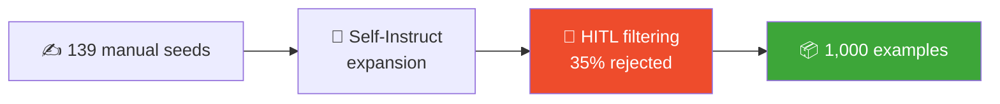

---
language:
- tr
license: cc-by-4.0
task_categories:
- text-generation
- question-answering
tags:
- stem
- education
- k12
- turkish
- instruction-tuning
- self-instruct
- arduino
- scratch
- robotics
pretty_name: STEM TR Instruct 1k
size_categories:
- 1K<n<10K
configs:
- config_name: default
  data_files:
  - split: train
    path: splits/train.jsonl
  - split: validation
    path: splits/validation.jsonl
  - split: test
    path: splits/test.jsonl
---

<div align="center">

# 🗂️ stem-tr-instruct-1k

### A **Turkish K–12 STEM & coding** instruction-tuning dataset


</div>

---

**1,000 Turkish instruction–response pairs** for K–12 STEM and coding education, covering **Arduino, Scratch, mBlock, robotics, Python, electronics and algorithms** across primary/middle/high-school levels. Code answers explain each line in Turkish.

## 📦 Composition

<table>
<tr><td>

| Field | Value |
|:--|:--|
| Total | **1,000** |
| Hand-written seeds | 139 |
| Self-Instruct | 861 |
| Raw → accepted | 1,325 → 861 (**35% reject**) |
| Splits | train 850 · val 50 · test 100 |
| Avg. answer | ~248 chars |

</td><td>

**Categories (7)**

| Category | # |
|:--|:--:|
| arduino | 155 |
| elektronik | 148 |
| python_stem | 145 |
| algoritma | 141 |
| scratch | 139 |
| mblock | 136 |
| robotik | 136 |

</td></tr>
</table>

**Difficulty distribution**

```text
ortaokul (middle)  ████████████████████ 420
ilkokul  (primary) ██████████████ 293
lise     (high)    ██████████████ 287
```

## 🧩 Schema

| Field | Description |
|:--|:--|
| `id` | unique id (`seed_XXXX` / `gen_XXXX`) |
| `category` | one of 7 categories |
| `difficulty` | `ilkokul` / `ortaokul` / `lise` |
| `instruction` | the student's question / task |
| `input` | optional extra context (usually empty) |
| `output` | detailed Turkish answer (line-by-line explained code) |
| `source` | `manual_seed` or `self_instruct` |

```json
{"id": "gen_0625", "category": "elektronik", "difficulty": "ortaokul",
 "instruction": "Bir cihaz 12 V gerilimde 0.5 A akım çekiyor. Gücünü ve 3 saatte harcadığı enerjiyi (Wh) bul.",
 "input": "",
 "output": "**P = V × I**, **E = P × t**.\n\nP = 12 × 0.5 = 6.00 W.\nE (3 saat) = 6.00 × 3 = **18.00 Wh**.",
 "source": "self_instruct"}
```

## 🔧 How it was built



1. **Manual seeds (139)** — hand-written, verified examples across 7 categories × 3 levels.
2. **Self-Instruct (861)** — LLM expansion from seeds (Wang et al., 2023) with ROUGE-L de-duplication. Numeric answers in *electronics / algorithms / Python* are **programmatically computed and verified**.
3. **Human-in-the-loop filtering (35% reject)** — automatic checks (length / format / language / similarity) + manual review. The 464 rejected items are kept with reasons in `rejected.jsonl` for transparency.

## 🚀 Usage

```python
from datasets import load_dataset
ds = load_dataset("sehinsahfanboy/stem-tr-instruct-1k")
print(ds["train"][0])
```

## ⚠️ Limitations

- Covers **only** K–12 STEM/coding; not for general-purpose use.
- 86% of examples are **LLM-generated**; despite filtering, rare errors may remain. Numeric items are verified, but open-ended pedagogical answers are not the only "correct" answer.
- Answers follow a **concise, templated style** — good for focused teaching, but limited in stylistic diversity.

## 📚 Citation

```bibtex
@misc{stem-tr-2026,
  title  = {stem-tr-instruct-1k: A Turkish K-12 STEM Instruction Dataset},
  author = {Alim Kacar},
  year   = {2026}
}
```

License **CC BY 4.0** · Method: Self-Instruct (Wang et al., 2023).

<div align="center"><sub>Alim Kacar · 2026</sub></div>
