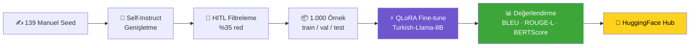

<div align="center">

# 🧠 Eding STEM TR

### Türkçe K–12 STEM/Kodlama için Instruction Veri Seti & QLoRA Fine-tuning

*Turkish-Llama-8B'yi tek GPU'da QLoRA ile eğiten, uçtan uca açık kaynak bir pipeline.*

<br>


</div>

---

> **Eding stajı · kendi başlattığım proje (2026).** Manuel seed yazımı → Self-Instruct genişletme → human-in-the-loop filtreleme → **QLoRA fine-tuning** → BLEU/ROUGE-L/BERTScore ile değerlendirme → HuggingFace Hub'da açık kaynak yayın.

<br>

## 📊 Sonuçlar

Ayrılmış test setinde (100 örnek) fine-tuned model, zero-shot base modeli **her metrikte açık ara** geçer:

```text
                 0        20        40        60        80      100
BLEU        base ██░░░░░░░░░░░░░░░░░░░░░░░░░░░░░░░░░░░░░░  4.8
            FT   ███████████████████░░░░░░░░░░░░░░░░░░░░░ 46.9   ▲ ~10×
ROUGE-L     base █████░░░░░░░░░░░░░░░░░░░░░░░░░░░░░░░░░░░ 12.1
            FT   █████████████████████████░░░░░░░░░░░░░░░ 61.4   ▲ ~5×
BERTScore   base █████████████████████░░░░░░░░░░░░░░░░░░░ 51.7
            FT   █████████████████████████████████░░░░░░░ 81.4   ▲ +29.7
```

| Metrik | 🔴 Base (zero-shot) | 🟢 Fine-tuned | Kazanç |
|:--|:--:|:--:|:--:|
| **BLEU** | 4.81 | **46.94** | **+42.1** |
| **ROUGE-L** | 12.05 | **61.38** | **+49.3** |
| **BERTScore-F1** | 51.70 | **81.43** | **+29.7** |

<details>
<summary><b>🔎 Dürüst yorum (tıkla)</b></summary>

<br>

BLEU/ROUGE'daki büyük farkın önemli kısmı, modelin veri setinin **kısa ve odaklı cevap biçimini** öğrenmesinden gelir; base model doğru ama gevezedir, bu yüzden referansla yüzeysel örtüşmesi düşüktür. **BERTScore** (anlamsal) artışı içerik yakınlığının da gerçekten iyileştiğini gösterir. Sonuç, *"hedef biçime güçlü hizalanma + anlamsal yakınlık artışı"* olarak okunmalıdır — mutlak "10× daha iyi cevap" değil.

</details>

<br>

## ✨ Öne çıkanlar

- 🗂️ **1.000 örneklik** Türkçe K-12 STEM/kodlama veri seti — 139 el-yazımı seed + 861 Self-Instruct genişletme.
- 🧹 **Human-in-the-loop filtreleme** ile **%35 red oranı** (1.325 ham üretim → 861 kabul).
- ⚡ **QLoRA (4-bit NF4, rank=16, tüm linear katmanlar)** → eğitilebilir parametre **%99.5 azaldı** (8.03B → 41.9M) + **NEFTune** ile kalite artışı.
- 🖥️ **T4 / L4 / A100** üzerinde çalışır — GPU'ya göre batch/dizi/precision **otomatik** ayarlanır.
- 📈 Ayrılmış test setinde baseline'a karşı **ölçülmüş, kanıtlı** iyileşme.

<br>

## 🗂️ Veri seti — `eding-stem-tr-instruct-1k`

<table>
<tr><td>

| Özellik | Değer |
|:--|:--|
| Toplam örnek | **1.000** |
| El-yazımı seed | 139 |
| Self-Instruct | 861 |
| Ham → kabul | 1.325 → 861 (**%35 red**) |
| Bölünme | 850 / 50 / 100 |
| Ort. cevap | ~248 karakter |

</td><td>

**Kategoriler (7)**
`arduino` · `scratch` · `mblock` · `robotik` · `python_stem` · `elektronik` · `algoritma`

**Zorluk (3)**
`ilkokul` · `ortaokul` · `lise`

**Alanlar**
`instruction` · `input` · `output` · `category` · `difficulty` · `source`

</td></tr>
</table>

```json
{"id": "seed_0001", "category": "arduino", "difficulty": "ortaokul",
 "instruction": "Arduino UNO ile bir LED'i saniyede bir yanıp söndüren kodu yaz ve her satırı açıkla.",
 "input": "", "output": "...", "source": "manual_seed"}
```

<br>

## 🔧 Pipeline



1. **Manuel seed (139)** — 7 kategori × 3 zorlukta el-yazımı, doğrulanmış örnekler.
2. **Self-Instruct (861)** — seed'lerden LLM ile üretim (Wang vd. 2023); ROUGE-L ile deduplikasyon. Elektronik/algoritma/Python cevapları programatik olarak **hesaplanıp doğrulanır**.
3. **HITL filtreleme (%35 red)** — otomatik (uzunluk/biçim/dil/benzerlik) + manuel; elenenler gerekçeleriyle `rejected.jsonl`'de.
4. **QLoRA fine-tuning** — 4-bit NF4, tüm linear katmanlara rank-16 LoRA + NEFTune; en iyi checkpoint doğrulama kaybına göre seçilir.
5. **Değerlendirme** — test setinde base vs fine-tuned.
6. **Yayın** — veri seti + adapter HuggingFace Hub'da.

<br>

## ⚙️ QLoRA verimliliği

<div align="center">

| | Değer |
|:--|:--:|
| Temel model | `ytu-ce-cosmos/Turkish-Llama-8b-Instruct-v0.1` |
| Toplam parametre | 8.030.261.248 |
| **Eğitilebilir** (r=16, tüm linear) | **41.943.040** |
| Eğitilebilir oran | **%0.52** |
| 🎯 **Azaltma** | **%99.48** |

</div>

```bash
python scripts/param_report.py --config configs/config.yaml
```

<br>

## 🚀 Kullanım

**En kolay — Colab (T4/L4/A100):** `notebooks/eding_stem_tr_colab.ipynb`'yi aç, GPU seç, hücreleri sırayla çalıştır. Kod GPU'yu algılayıp ayarları otomatik seçer.

**Ya da yerelde / script:**

```bash
pip install -r requirements.txt
python src/build_dataset.py                                   # veri setini yeniden üret (seed=42)
python src/qlora_finetune.py --config configs/config.yaml     # QLoRA eğitim
python src/evaluate.py --config configs/config.yaml \
    --adapter outputs/qlora-checkpoints/final-adapter \
    --test data/splits/test.jsonl --skip-judge                # değerlendirme
python src/publish_hub.py --config configs/config.yaml --hf-token $HF_TOKEN
```

<br>

## 📁 Proje yapısı

```
eding-stem-tr/
├── configs/config.yaml           # Tüm pipeline parametreleri
├── data/
│   ├── seeds/seed_examples.jsonl          # 139 el-yazımı seed
│   ├── generated_raw.jsonl / rejected.jsonl   # ham üretim + elenenler (%35)
│   ├── eding-stem-tr-instruct-1k.jsonl    # NİHAİ 1.000 örnek
│   └── splits/{train,validation,test}.jsonl
├── src/
│   ├── build_dataset.py          # yeniden üretilebilir veri derleyici
│   ├── self_instruct.py · filter_hitl.py
│   ├── qlora_finetune.py         # QLoRA (transformers.Trainer, TRL'siz)
│   ├── evaluate.py · publish_hub.py
├── scripts/param_report.py       # parametre azaltma raporu
├── notebooks/eding_stem_tr_colab.ipynb   # tek dosya, self-contained
├── outputs/evaluation/results.json       # değerlendirme sonuçları
├── DATASET_CARD.md · MODEL_CARD.md · NEXT_STEPS.md
└── requirements.txt
```

<br>

## ⚠️ Sınırlamalar

- Yalnızca K–12 STEM/kodlama alanına özeldir; alan dışında güvenilmez.
- Küçük (1.000) ve ağırlıkla sentetik veri → cevaplar **kısa/şablonlaşmaya** eğilimli; bazı sorularda base modele göre daha az detay verebilir. Metrik artışının bir kısmı içerik kalitesinden çok **biçim hizalanmasından** gelir.
- Genişletme örnekleri LLM üretimidir; filtreye rağmen nadiren hata içerebilir. Kod/donanım çıktıları gözetimle kullanılmalı.

<br>

## 📜 Lisans & atıf

Kod **MIT** · Veri seti **CC BY 4.0** · Temel model **Llama-3** lisansına tabidir.
Yöntemler: *QLoRA* (Dettmers vd. 2023), *LoRA* (Hu vd. 2021), *Self-Instruct* (Wang vd. 2023), *NEFTune* (Jain vd. 2023).

<div align="center">

**Alim Kacar** · Eding Stajı 2026
🤗 [Dataset](https://huggingface.co/datasets/sehinsahfanboy/eding-stem-tr-instruct-1k) · [Model](https://huggingface.co/sehinsahfanboy/Turkish-Llama-8B-STEM-QLoRA)

</div>
